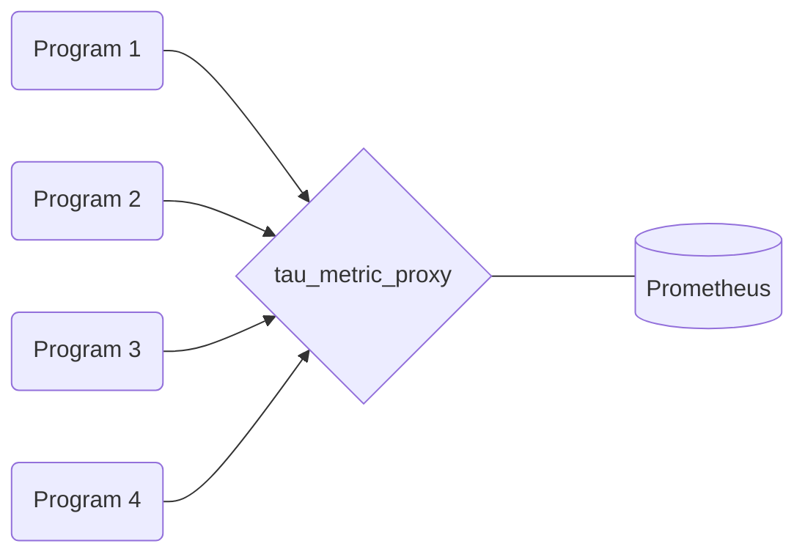

# Overview

The `tau_metric_proxy` is an aggregating gateway for the Prometheus time-series database. Its goal is to collect at high-frequency the state of the various applications running on a given node while exposing the metrics to a Prometheus server.



When running your program you instrument it with various **collectors** in charge of forwarding data to the `tau_metric_proxy`. This proxy will sum these contributions locally while exposing them for scraping (the action of storing metrics in the Prometheus DB) at fixed interval.

As of now tow main data collections models are provided:
- MPI instrumentation (all MPI calls and their size over time)
- And syscall instrumentation (all syscalls and size of I/O ones over time)

# Launching Instrumented Programs

The measurement process can be seen as three steps:
 - Starting the `tau_metric_proxy`
 - Ensuring performance collection is enabled
	 - Either simply using Prometheus (requires a running prometheus on each node)
	 - Or using the `tau_metric_proxy_client` to consume data (no extra dependency) with higher frequencies
 - Running the instrumented program using `tau_metric_proxy_run`
 
## Starting the proxy

The `tau_metric_proxy` is intended to be a persistent daemon on the compute nodes. Therefore, in the meantime, you'll have to run it manually on the target compute nodes.

This can be done by running on each node:

```
tau_metric_proxy
```

This should display:

```
INFO (tau_metric_exporter_init:483): now listening on 0.0.0.0:1337
INFO (__bind_unix_socket:212): UNIX push gateway running on /tmp/tau_metric_proxy.1000.unix
```

This outlines that the metric proxy is two servers:
- A UNIX socket awaiting metrics from the optimized collectors
- A TCP server exposing an lightweight HTTP endpoint in http://127.0.0.1:1337/metrics/ for Prometheus

## Running the Program

As of now, the `metric_proxy` can run two main instrumentation:
- MPI Calls
- Syscalls

This instrumentation can be done with a dedicated wrapper:

```
tau_metric_proxy_run -m -s -v -h -u [PATH] -S [PID] -- [COMMAND]

Wrapper to run commands instrumented for the tau_metric_proxy.

-m: enable MPI profiling
-s: enable strace profiling (requires tau_strace in path)
-S [PID]: attach tau_strace to a running process id (COMMAND is ignored, no MPI instrum)
-u [PATH]: specify path to tau_metric_proxy push gateway UNIX socket
-v: enable verbose output
-h: show this help
```

The common way being to run:

```
mpirun -np 10 tau_metric_proxy_run -m -s -- ./a.out
```


- **-m** for MPI
- **-s** for strace (needs `tau_strace` in the PATH)

==Make sure you have started the `tau_metric_proxy` first as it is designed to still work if not profiled (always-on monitoring).

Note it is also possible to attach strace instrumentation to a running program with `tau_metric_proxy_run -S [PID]` and doing CTRL+C will not kill the target program (needs `tau_strace` in path).

# Getting Performance Data

There are two mains ways to gather performance data. First either using Prometheus or through the command line interface. We will first describe the "easy" one through the command line as it incurs no extra dependency.

## Data From the CLI

A python program able to directly communicate with the proxy is furnished. 

:::warning
The drawback being that it runs on each node and therefore does not provide a unified view.
:::

 It has the following interface:

```
usage: tau_metric_client [-h] [-o OUTPUT] [-u UNIX] [-F FREQ] [-f {md,json,yaml,txt}] [-l] [-v] [-g GET] [-t]
                         [-T TRACK_LIST]

tau_metric_proxy client

optional arguments:
  -h, --help            show this help message and exit
  -o OUTPUT, --output OUTPUT
                        File to store the result to
  -u UNIX, --unix UNIX  Path to the tau_metric_proxy UNIX socket
  -F FREQ, --freq FREQ  Sampling frequency (for data retrieval)
  -f {md,json,yaml,txt}, --format {md,json,yaml,txt}
                        Path to the tau_metric_proxy UNIX socket
  -l, --list            List metrics in the tau_metric_proxy
  -v, --values          List all values in the tau_metric_proxy
  -g GET, --get GET     Get values by name (comma separated)
  -t, --track           Track all non-null counters over time
  -T TRACK_LIST, --track-list TRACK_LIST
                        Track a given list of values over time
```

### Listing Keys In the Proxy

One can get keys list and their documentation (default format "md")

```
 tau_metric_client -l
```

```
╔═════════════════════════════════════════════════════════════════════╗
║                 List of tau_metric_exporter Metrics                 ║
╚═════════════════════════════════════════════════════════════════════╝

 • tau_metric_proxy_run_total{operation="exec"} (TAU_METRIC_COUNTER) :
   Number of launch with the tau_metric_proxy_run command
```

To get it in JSON simply do:

```
 tau_metric_client -l -f json
```

```json
[
    {
        "name": "tau_metric_proxy_run_total{operation=\"exec\"}",
        "doc": "Number of launch with the tau_metric_proxy_run command",
        "type": "TAU_METRIC_COUNTER"
    }
]
```

And there is also a "plain text" format:

```
# name doc type
tau_metric_proxy_run_total{operation="exec"} "Number of launch with the tau_metric_proxy_run command" TAU_METRIC_COUNTER
``` 


### Getting All Values from the Proxy

```
tau_metric_client -v -f json
```

```json
[
    {
        "name": "tau_metric_proxy_run_total{operation=\"exec\"}",
        "ts": 1667486717.483395,
        "value": 9.0
    },
    // Other values ...
]
```

In these data we have:
- The metric name
- Its last value change timestamp
- Its last value

### Getting Values by Name

```
tau_metric_client -g "tau_metric_proxy_run_total{operation=\"exec\"}" -f json
```

(Note this can be a comma separated list)

```json
[
    {
        "name": "tau_metric_proxy_run_total{operation=\"exec\"}",
        "ts": 1667486717.483395,
        "value": 9.0
    },
]
```

### Tracking Values Over Time

The client can also track values to a file (on change) with a given polling frequency (potentially much larger than Prometheus). To do so one can do:

```
tau_metric_client -t -o log.json -F 10
``` 

It should say:

``` 
Logging in log.json interrupt with CTRL + C when done...
``` 

:::warning
Note that we have set a sampling period of 0.1 SEC **inside** the client library at the top of `src/client/metric_client.c` if you want to go over 10Hz you'll need to change it increasing the client-side load.
:::


As the program is running it will dump changed metrics at each timestep accoring to the frequency. For example monitoring an `ls -R` at frequency 1 Hz we have:

```json
[
  [
    {
      "name": "strace_hits_total{scall=\"rt_sigprocmask\"}",
      "ts": 1667487668.706448,
      "value": 3
    },
    {
      "name": "strace_size_total{scall=\"read\"}",
      "ts": 1667487668.706464,
      "value": 22716
    },
	// (...)
    {
      "name": "tau_metric_proxy_run_total{operation=\"exec\"}",
      "ts": 1667487734.198543,
      "value": 15
    },
    {
      "name": "strace_hits_total{scall=\"close\"}",
      "ts": 1667487734.197366,
      "value": 716
    }
  ],
  // (NEXT Sampling and so on ...)
]
```

It is also possible to track a comma separated list of syscalls. For example if we track:

```
tau_metric_proxy_run -s -- grep -rHn "LOL" /
```

We can track all the reads at 10Hz with:

```
tau_metric_client -T strace_size_total{scall=\"read\"} -o log.json -F 10
```

Note that the counter is monotonically incremented accounting for past reads seen by the proxy.

```json
[
  [
    {
      "name": "strace_size_total{scall=\"read\"}",
      "ts": 1667488121.36058,
      "value": 10315325653
    }
  ],
  //...
  [
    {
      "name": "strace_size_total{scall=\"read\"}",
      "ts": 1667488123.276557,
      "value": 10343854648
    }
  ],
  [
    {
      "name": "strace_size_total{scall=\"read\"}",
      "ts": 1667488123.382689,
      "value": 10344148567
    }
  ]
]
```


## Using Prometheus

In ADMIRE our initial plan is to have a Prometheus running on each node to distribute the storage load over the machine. This Prometheus will then scrape only local metrics. However, in the case of a manual deployment it can be cumbersome. What we recommend is running a single Prometheus targeting the multiple `tau_metric_proxy` waiting for the faster TBON spatial aggregation we are preparing.

### Configuring Prometheus

Sample Prometheus configuration extension (note a simple initial config can be found [here](https://prometheus.io/docs/prometheus/latest/getting_started/#configuring-prometheus-to-monitor-itself))

```yaml
# Sample addition to Prometheus config
scrape_configs:

  - job_name: tau1
    scrape_interval: 1s
    scrape_timeout: 1s
    static_configs:
      - targets: ['NODEA:1337']


  - job_name: tau2
    scrape_interval: 1s
    scrape_timeout: 1s

    static_configs:
      - targets: ['NODEB:1337']

```

If this starts to be of interest in your case we can work on a script to generate the config. Note that you may compile Prometheus with spack using the `+prometheus` variant when installing the `tau_metric_proxy`.


### Running Prometheus

You may then point it to your configuration to launch it for example on the login node:

```
prometheus --config.file=./prometheus.yml
``` 

### Sample Aggregating Queries

If you now look at the 9090 port on the login node you should have an interface allowing you to look at the data stored in the Time-Serie Data-Base (TSDB). Note you can port forward to access it:

```
ssh login-node -L8081:localhost:9090
```

and then open http://127.0.0.1:8081.

If we look at some strace time series for example we can have the total size with the query: strace_time_total{scall="read"}

